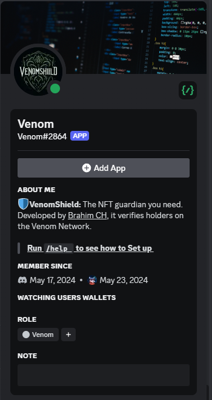
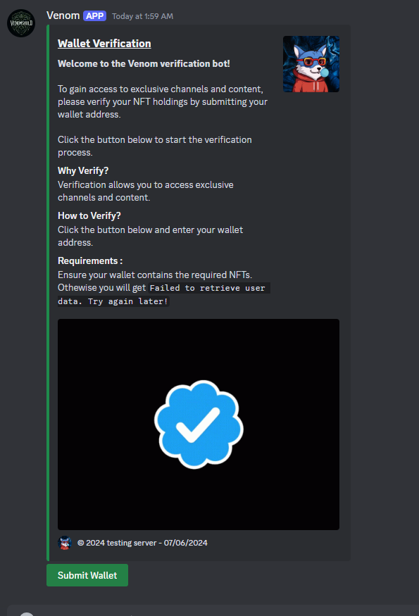
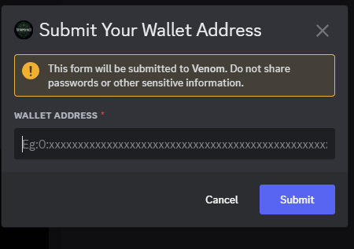
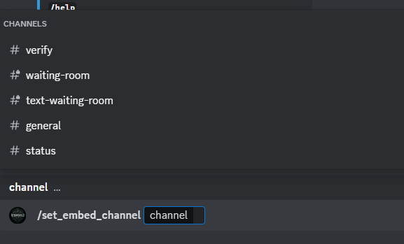
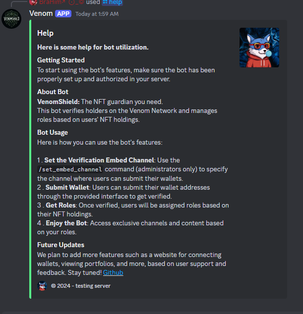
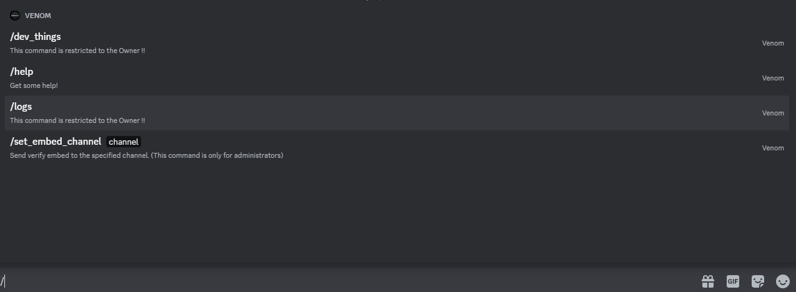

<h1 align="center">Here are some pictures of the bot</h1>

Here is a quick show of the bot and commands:

**Profile pic:**

**Embed to Submit:**

**Modal Submit:**

**Command to Set Embed Channel:**

**Help Command:**

**Commands:**

